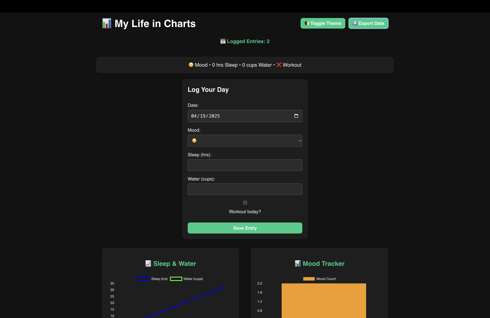

# 📊 Moodlytics

**Moodlytics** is a sleek and animated desktop app built with **Electron + React + Vite + Chart.js**.  
Track your daily mood, sleep, water intake, and workouts — all visualized with clean, modern charts.

---

## 🚀 Features

- 🧠 Log your **daily habits** with mood, sleep, water, and workout status  
- 📅 Select and record entries for **any date**  
- 📈 View visual insights with **line + bar charts**  
- 🌗 Toggle between **light/dark mode**  
- 🧾 View a clean **summary card** for today's stats  
- 📤 Export your data as `.json`  
- 💨 Smooth **UI animations**

---

## 🖥️ Screenshot



---

## 📦 Installation

```bash
# Clone the repo
git clone https://github.com/zlk1l/Moodlytics.git
cd Moodlytics

# Install dependencies
npm install

# Run the app in dev mode
npm run dev         # Terminal 1
npm run electron    # Terminal 2
